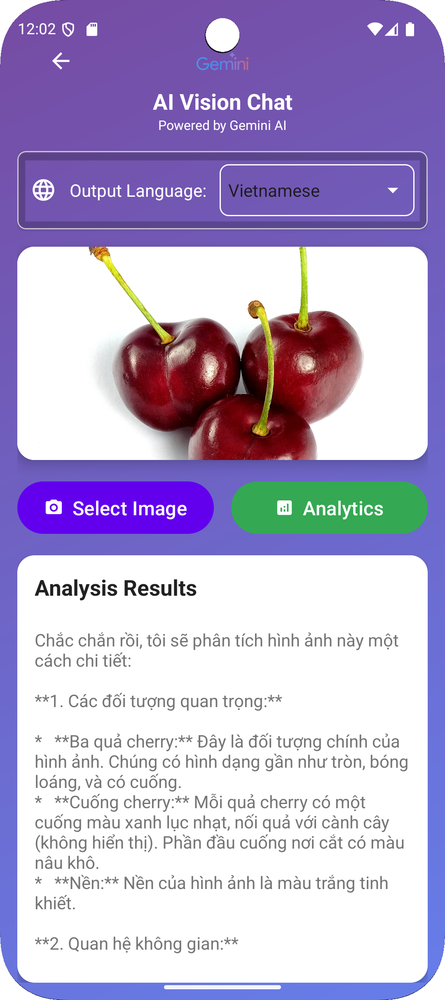
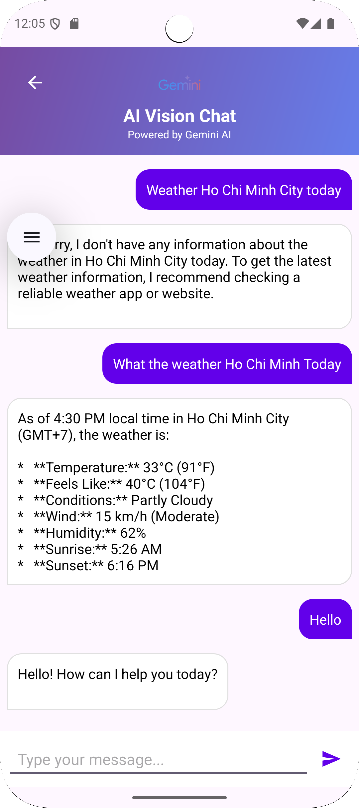

# AI Vision Detector with Gemini AI




An Android application that provides advanced image analysis and conversational AI capabilities powered by Google's Gemini AI.

## Table of Contents
- [Features](#features)
- [Requirements](#requirements)
- [Installation](#installation)
- [Configuration](#configuration)
- [Usage](#usage)
- [Code Structure](#code-structure)
- [Error Handling](#error-handling)
- [Contributing](#contributing)
- [License](#license)

## Features

### Image Analysis
- 🔍 Detailed object detection and recognition
- 🗺️ Spatial relationship mapping
- 🎨 Color and texture analysis
- 📖 Text recognition (OCR)
- 🌍 Multi-language support

### AI Chat Interface
- 💬 Natural language conversations
- 🧠 Context-aware responses
- ⏳ Typing indicators
- ♻️ Automatic retry on failures

### User Experience
- 📱 Responsive Material Design UI
- 🎚️ Adaptive light/dark theme
- 📊 Real-time processing feedback
- ⚡ Performance optimized

## Requirements

- Android Studio Giraffe (2022.3.1) or newer
- Android SDK 35 (Android 15)
- Java 17 or Kotlin 1.9.0
- Google Gemini API key

## Installation

1. Clone the repository:
   ```bash
   git clone https://github.com/Trung78z/DetectionWithAIAndroid.git
   cd DetectionWithAI
   ```

2. Set up your API key:
Update class `GeminiConfig` with:
```properties
public class GeminiConfig {
    public static final String API_KEY = "xxxxxxxxxxxxxxxxxx";
    public static final String MODEL_NAME = "gemini-2.0-flash"; // Replace model using 
}
```

3. Open in Android Studio and build the project.

## Configuration

### Runtime Permissions
The app requires these Android permissions:
- `INTERNET` - For API communication
- `CAMERA` - For image capture
- `READ_EXTERNAL_STORAGE` - For gallery access

### Gradle Dependencies
Key dependencies in `app/build.gradle`:
```gradle
dependencies {
    implementation 'com.google.ai.client.generativeai:generativeai:0.1.1'
    implementation 'androidx.recyclerview:recyclerview:1.3.2'
    implementation 'com.google.android.material:material:1.11.0'
    implementation 'androidx.constraintlayout:constraintlayout:2.2.0-alpha13'
}
```

## Usage

### Image Analysis Flow
- Tap the camera button
- Choose to capture new photo or select from gallery
- View comprehensive analysis including:
  - Identified objects with confidence scores
  - Color palette extraction
  - Text recognition results
  - Spatial arrangement visualization

### AI Chat Interface
- Type your message in the input field
- Send with the send button or Enter key
- Special commands:
  - `/clear` - Reset conversation history
  - `/lang en` - Switch to English
  - `/lang vi` - Switch to Vietnamese
  - `/help` - Show command list

## Code Structure
```
app/
├── src/
│   ├── main/
│   │   ├── java/com/hcmus/detectionwithai/
│   │   │   ├── activity/
│   │   │   │   ├── AnalysisActivity.java
│   │   │   │   ├── ChatActivity.java
│   │   │   │   └── MainActivity.java
│   │   │   ├── adapter/
│   │   │   │   ├── AnalysisResultAdapter.java
│   │   │   │   └── ChatAdapter.java
│   │   │   ├── gemini/
│   │   │   │   ├── GeminiAnalyzer.java
│   │   │   │   └── GeminiConfig.java
│   │   │   └── model/
│   │   │       ├── AnalysisResult.java
│   │   │       └── ChatMessage.java
│   │   └── res/
│   │       ├── layout/
│   │       ├── drawable/
│   │       └── values/
│   └── test/
├── build.gradle
└── gemini_config.properties
```

## Error Handling
The app handles various error scenarios gracefully:

| Error Scenario   | User Feedback                        | Automatic Action                         |
|------------------|--------------------------------------|------------------------------------------|
| Network issues   | "Connection problem. Retrying..."    | 3 retries with exponential backoff       |
| API limits       | "Server busy. Please wait"           | Disables input for 30 seconds            |
| Large images     | "Optimizing your image..."           | Auto-resizes to 2048px width             |
| Timeouts         | "Taking longer than expected"        | Single retry after 5 seconds             |
| Invalid input    | "Please try a different image"       | Clears input field                       |

## Contributing
We welcome contributions! Please follow these steps:

1. Fork the repository  
2. Create a feature branch (`git checkout -b feature/release-v1`)  
3. Commit your changes (`git commit -m 'Add some feature'`)  
4. Push to the branch (`git push origin feature/release-v1`)  
5. Open a Pull Request

Please ensure your code follows:
- Android Java style guide
- Proper null safety practices
- Comprehensive error handling
- Unit tests for new features

---

## 📩 8. Liên hệ
Nếu có thắc mắc hoặc góp ý, vui lòng liên hệ qua email: `trungpspy@gmail.com` & `quanh.0807@gmail.com`.